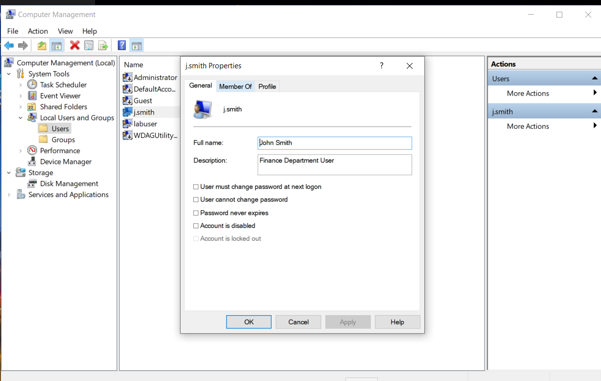
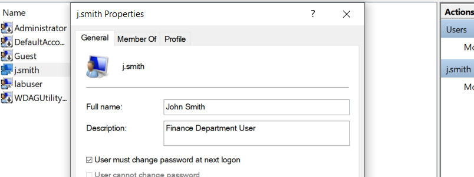
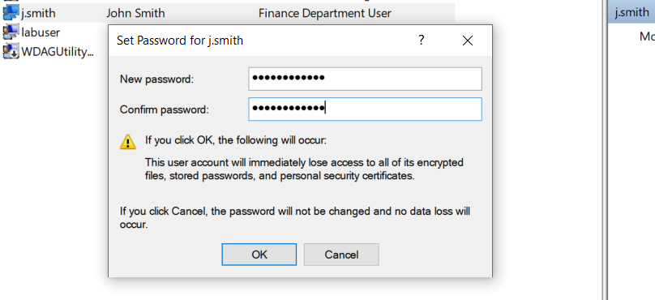
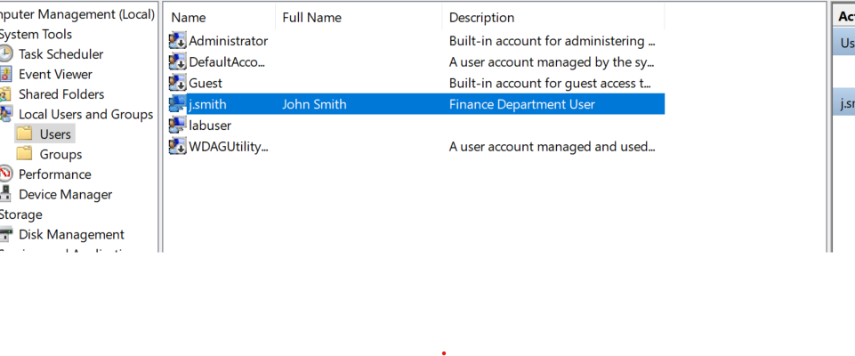

# 🖥️ IT Support Ticket 005 – Reset a Windows User Password and Configure Password Settings

---

## 📋 Ticket Information

| Item | Details |
|------|---------|
| **Ticket ID** | ITSUP-005 |
| **Category** | Windows Administration |
| **Difficulty** | Beginner |
| **Estimated Time** | 15–20 Minutes |
| **Operating System** | Windows 10 |
| **Tool Used** | Computer Management |

---

# 📌 Objective

This lab demonstrates how to reset a local Windows user password and configure password settings using **Computer Management**.

The objective is to perform a common Windows administration task frequently carried out by IT Support Technicians, Help Desk Analysts, Desktop Support Engineers, and Junior System Administrators.

---

# 🎯 Help Desk Scenario

A user has forgotten their password and is unable to sign in to their Windows account.

As the IT Support Technician, I was responsible for:

- Reviewing the user's account properties
- Configuring the account to require a password change at the next logon
- Resetting the user's password
- Verifying the account after the password reset

---

# 🛠️ Environment

- Windows 10
- Computer Management
- Local Users and Groups
- Local User Accounts

---

# 💼 Skills Demonstrated

- Windows Administration
- Password Management
- Local User Management
- User Account Configuration
- Windows Computer Management
- Help Desk Support
- Technical Documentation

---

# 📝 Procedure

## Step 1 — Review User Properties

Opened the properties of the **j.smith** local user account before making any changes.

### Screenshot

---

## Step 2 — Configure Password Settings

Enabled the **User must change password at next logon** option to ensure the user creates a new password after signing in.

### Screenshot

---

## Step 3 — Reset the Password

Opened the **Set Password** dialog and assigned a temporary password to the account.

### Screenshot

---

## Step 4 — Verify the Password Reset

Returned to the Users list to verify that the account remained available after the password reset.

### Screenshot

---

# ✅ Result

The local user account password was successfully reset.

The account was configured to require the user to change their password at the next logon, following common Windows security best practices.

---

# 🎓 Key Learning Outcomes

This lab provided hands-on experience with:

- Resetting Windows user passwords
- Configuring password policies
- Managing local user accounts
- Using Computer Management
- Performing common Help Desk password reset procedures
- Documenting technical work for a professional portfolio

---

# 🎥 Video Demonstration

**YouTube Walkthrough:**

https://youtu.be/eDdt0yHGCt0

---

# 📚 Technologies Used

- Windows 10
- Computer Management
- Local Users and Groups
- GitHub
- OBS Studio
- Clipchamp

---

## ⭐ Portfolio Series

This repository is part of my hands-on **Windows IT Support Lab Series**, where I document practical Windows administration tasks performed in a real-world IT support workflow.
